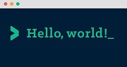

#  👋 Soy Miriam Verdú Francés

### Una apasionada desarrolladora frontend viviendo en Madrid

Este proyecto realizado con **React** te permite guardar tus locales favoritos, pudiendo filtrar cuales abren entre semana o los fines de semana.

## 📄 ¿Qué necesitas tener instalado para ejecutar este proyecto?

- Node
- npm
- Gulp

Una vez todo instalado, es importante **arrancar el proyecto** y para ello tienes que ejecutar los siguientes comandos en la terminal:

1. ```bash
   npm install
   ```
2. ```bash
   npm start
   ```

## 👨‍💻 ¡Ya tenemos todo!, ¡vamos al lío!

Mi trabajo en este proyecto se centra en la carpeta `src/`, donde se encuentran los ficheros HTML, SASS, images...

Una vez arrancado el proyecto como hemos comentado, a partir de estos ficheros `src/` se generarán automáticamente `public/` y `docs/`.

La estructura de carpetas que nos ocupan es la siguiente:

```
src
 ├─ components
 |  └─ App.js
 ├─ data
 |  └─ contacts.json
 ├─ styles
 |  ├─ core.js
 |       └─ Reset.scss
 |       └─ Variables.scss
 |  └─ App.scss

```

## ⚡ ¡A trastear!
